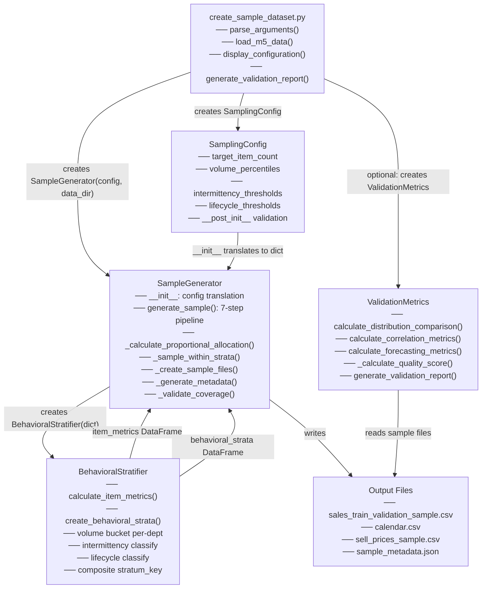

# Sampling System — Code Walkthrough

> Written as a senior data scientist reading this codebase for the first time.
> The goal is not to list every function but to explain **why** each piece exists, **what** it does, and **how** the pieces connect — in the order that builds the clearest mental model.

---

## Table of Contents

1. [Context — Why This System Exists](#1-context--why-this-system-exists)
2. [Reading `config.py` — The Contract](#2-reading-configpy--the-contract)
3. [Reading `behavioral_stratifier.py` — The Anti-Bias Engine](#3-reading-behavioral_stratifierpy--the-anti-bias-engine)
4. [Reading `sample_generator.py` — The Orchestrator](#4-reading-sample_generatorpy--the-orchestrator)
5. [Reading `validation_metrics.py` — The Quality Gate](#5-reading-validation_metricspy--the-quality-gate)
6. [Reading `create_sample_dataset.py` — The Entry Point](#6-reading-create_sample_datasetpy--the-entry-point)
7. [Key Insights and Non-Obvious Details](#7-key-insights-and-non-obvious-details)
8. [Component Interaction Map](#8-component-interaction-map)

---

## 1. Context — Why This System Exists

Before reading a single line of code, a senior DS always asks: what problem is this solving, and why is the naive approach insufficient?

### The scale problem

The full M5 Walmart dataset has **30,490 item-store combinations** covering 1,941 days of daily sales. On an M3 Pro MacBook, end-to-end model training takes 60+ minutes. For rapid POC iteration that is impractical.

The instinct is: "just take a random 5% of rows" or "take the top 1,400 most-sold items." Both approaches fail, but in a subtle way that only surfaces later when you try to deploy to production.

### Why naive sampling creates a hidden trap

Consider what the top-N high-volume items look like: they sell nearly every day, they have clean regular patterns, and their forecasting errors are low. A model trained and evaluated on those items will appear to work beautifully. Then in production, the model encounters intermittent-demand products — items that sell on only 10% of days, with sporadic spikes — and accuracy collapses.

This is **optimism bias through sampling**. You trained on the easy cases and evaluated on the easy cases. You never validated on the hard cases.

The hard cases in M5 are the **sparse and intermittent products** — items with ≤20% or 20–60% nonzero sales days. They are the forecasting challenge, and they need proportional representation in your sample.

### The solution: behavioral stratification

The system divides all items into **behavioral strata** across three dimensions:

- **Volume** (within each department, not globally): low / medium / high / very-high
- **Intermittency**: sparse / intermittent / regular
- **Lifecycle**: early / mature / declining / discontinued / minimal

Then it **randomly samples** within each stratum proportionally. No ranking. No quality scoring. Every sparse item within a stratum has the same probability of being selected as every regular-demand item within its stratum. This guarantees that the sample reflects the full challenge spectrum of production demand patterns.

---

## 2. Reading `config.py` — The Contract

**File:** `src/demand_forecast_intelligence/data/sampling/config.py`

The first thing to read in any ML system is the configuration. It acts as a written contract — every parameter embeds a deliberate design decision. Reading `SamplingConfig` tells you almost everything about how the system works before you read the algorithm code.

### The dataclass structure

```python
@dataclass
class SamplingConfig:
    target_item_count: int = 1400
    random_seed: int = 42
    training_end_day: str = "d_1913"
    min_per_dept: int = 30
    min_per_stratum: int = 2
    volume_percentiles: List[int] = [0, 25, 75, 95, 100]
    intermittency_thresholds: List[float] = [0.2, 0.6]
    lifecycle_thresholds: Dict[str, Any] = {...}
    lifecycle_windows: Dict[str, int] = {...}
```

### Parameter-by-parameter reasoning

**`target_item_count = 1400`**

The M5 dataset has 3,049 unique items (across 10 stores, giving 30,490 item-store rows). Targeting 1,400 unique items means sampling ~46% of unique items, which translates to roughly 50–60% reduction in total dataset rows — enough to cut training time from 60+ minutes to 20–30 minutes while retaining enough items for statistically meaningful model validation.

**`training_end_day = "d_1913"`**

This is the anti-leakage boundary. The M5 training period covers d_1 to d_1913. The evaluation period extends beyond that. Every stratification decision — every metric the system uses to decide which bucket an item belongs to — must be calculated using only training-period data. Including even a single evaluation-period column in the behavioral feature calculation would contaminate the sampling decision with future information, invalidating the POC validation. This field marks where that boundary sits.

**`volume_percentiles = [0, 25, 75, 95, 100]`**

This produces **four** volume strata, not five. The 0 and 100 are sentinel boundaries — they mark the edges of the distribution but do not define cut points between buckets. The inner cut points are [25, 75, 95], which produce:

| Stratum | Percentile Range | Label |
|---------|-----------------|-------|
| 0–25th | Bottom quarter | `low` |
| 25–75th | Middle half | `medium` |
| 75–95th | Upper quartile minus top | `high` |
| 95–100th | Top 5% | `very_high` |

The asymmetry is intentional. Retail sales distributions are heavily right-skewed (a small number of products drives the majority of revenue). The 95th percentile cut isolates the truly exceptional movers, preventing them from diluting the "high" bucket.

> **Important:** The `SampleGenerator.__init__` strips the 0 and 100 sentinels before passing the list to `BehavioralStratifier`. A reader who misses this detail will be confused about why the stratifier receives `[25, 75, 95]` when the config says `[0, 25, 75, 95, 100]`.

**`intermittency_thresholds = [0.2, 0.6]`**

Two thresholds produce three intermittency classes:

| Condition | Class |
|-----------|-------|
| nonzero_day_ratio ≤ 0.2 | `sparse` |
| 0.2 < nonzero_day_ratio ≤ 0.6 | `intermittent` |
| nonzero_day_ratio > 0.6 | `regular` |

The 20% boundary reflects the standard retail definition of "sparse demand" — an item that sells on fewer than one in five days is fundamentally different to model than one that sells most days. The 60% boundary separates items that need intermittent-demand forecasting models from those suitable for standard time-series approaches.

**`min_per_dept = 30` and `min_per_stratum = 2`**

These are floor constraints that prevent statistically hollow segments. The department minimum (30) ensures all 7 M5 departments (FOODS_1, FOODS_2, FOODS_3, HOBBIES_1, HOBBIES_2, HOUSEHOLD_1, HOUSEHOLD_2) have enough items for cross-department model comparison. The stratum minimum (2) prevents any single behavioral combination from being entirely absent, but is deliberately low so the natural distribution drives allocation.

**`lifecycle_thresholds` and `lifecycle_windows`**

These work together. `lifecycle_thresholds` sets the M5-day boundaries that define "early" vs "late" phases of an item's presence in the dataset. `lifecycle_windows` defines the rolling window sizes (in days) that `BehavioralStratifier` uses to measure activity in those phases:

```python
lifecycle_thresholds = {
    "early_end": "d_1000",         # End of early phase
    "late_start": "d_1000",        # Start of late phase
    "longrun_min_span": 900,       # Min days to be "long-running"
    "discontinued_cutoff": "d_1700"  # Items ending before this are discontinued
}

lifecycle_windows = {
    "early_period_days": 365,   # First 365 days = early window
    "late_period_days": 365,    # Last 365 days = late window
    "min_active_days": 30       # Below this = "minimal" stage
}
```

The lifecycle windows are what the stratifier actually uses for calculations — it takes the first 365 days and last 365 days of the training period and compares their sales totals.

### `__post_init__` validation

The validation block is worth reading carefully because it documents all the implicit invariants:

- `target_item_count > 0` — obvious
- `random_seed >= 0` — numpy compatibility
- `training_end_day` matches `r'^d_\d+$'` — enforces M5 date format
- `volume_percentiles` must be non-empty, in [0,100], and sorted ascending
- `intermittency_thresholds` must be non-empty, in [0,1], and sorted ascending
- `lifecycle_thresholds` must contain all four required keys, date-format values validated separately
- `lifecycle_windows` values must all be positive integers

The regex `r'^d_\d+$'` appears three times — for `training_end_day` and for the two lifecycle date thresholds. This is the M5 day-column naming convention (`d_1`, `d_913`, `d_1913`) applied to configuration validation.

---

## 3. Reading `behavioral_stratifier.py` — The Anti-Bias Engine

**File:** `src/demand_forecast_intelligence/data/sampling/behavioral_stratifier.py`

The `BehavioralStratifier` class is the mathematical heart of the system. It has two public methods that must be called in sequence: first `calculate_item_metrics()`, then `create_behavioral_strata()`.

### What the stratifier receives

```python
def __init__(self, config: Dict[str, Any]):
    self.volume_buckets = config['volume_buckets']        # ['low','medium','high','very_high']
    self.volume_percentiles = config['volume_percentiles'] # [25, 75, 95] — sentinels stripped
    self.intermittency_thresholds = config['intermittency_thresholds']  # {'sparse': 0.2, 'intermittent': 0.6}
    self.lifecycle_windows = config['lifecycle_windows']  # {'early_period': 365, 'late_period': 365, ...}
```

Notice the config format here is a **plain dict**, not a `SamplingConfig` instance. The `SampleGenerator` is responsible for translating between the two. This is a deliberate separation of concerns: the stratifier is pure computation that knows nothing about the project's configuration dataclass.

---

### Method 1: `calculate_item_metrics(sales_data)` — Training-Only Feature Extraction

This method extracts behavioral features from raw M5 sales data. The most important thing it does is filter to training-period columns only.

**Column extraction:**

```python
training_columns = [f'd_{i}' for i in range(1, 1914)]
available_training_columns = [col for col in training_columns if col in sales_data.columns]
```

The first line generates the complete list of d_1 through d_1913 column names. The second line filters to only those actually present in the DataFrame — this is defensive coding for cases where a reduced dataset might not have all columns. If no training columns exist at all, it raises immediately with a clear error.

**Volume metrics:**

```python
sales_values = sales_data[available_training_columns].values  # shape: (n_items, n_days)

metrics['total_sales'] = sales_values.sum(axis=1)
metrics['avg_daily_sales'] = metrics['total_sales'] / metrics['total_days']
```

The `.values` call extracts the NumPy array from the DataFrame before doing the aggregation. This is a performance pattern — NumPy operations on raw arrays are significantly faster than pandas operations on wide DataFrames, and with 30,490 rows × 1,913 columns this matters.

**Intermittency metric:**

```python
metrics['nonzero_days'] = (sales_values > 0).sum(axis=1)
metrics['nonzero_day_ratio'] = metrics['nonzero_days'] / metrics['total_days']
```

The boolean mask `(sales_values > 0)` produces a matrix of True/False, then `.sum(axis=1)` counts the True values per row. This is the proportion of days on which an item actually sold something — the core intermittency signal.

**Lifecycle window metrics:**

```python
early_days = self.lifecycle_windows['early_period']
late_days = self.lifecycle_windows['late_period']

early_sales = sales_values[:, :early_days].sum(axis=1)   # First 365 days
late_sales  = sales_values[:, -late_days:].sum(axis=1)   # Last 365 days
```

The column slices `[:, :early_days]` and `[:, -late_days:]` extract the first and last 365 days respectively. The defensive `if early_days <= len(available_training_columns)` guard handles edge cases where a test dataset is shorter than 365 days. In production M5 data (1,913 training days), this guard never triggers.

---

### Method 2: `create_behavioral_strata(metrics)` — The Three-Dimensional Classification

This method takes the metrics produced above and assigns each item three labels plus a composite stratum key. It works in four sequential sub-steps.

**Sub-step 1: Volume bucketing within departments**

```python
for dept in strata['dept_id'].unique():
    dept_mask = strata['dept_id'] == dept
    dept_data = strata.loc[dept_mask]

    dept_sales = dept_data['avg_daily_sales'].values
    percentile_values = np.percentile(dept_sales, self.volume_percentiles)  # [25th, 75th, 95th values]

    dept_buckets = [
        self.volume_buckets[int(np.sum(sales > percentile_values))]
        for sales in dept_sales
    ]
```

The key line to understand is `int(np.sum(sales > percentile_values))`. For a single item's `avg_daily_sales` value, this compares it against all three threshold values and counts how many it exceeds:

- Exceeds 0 thresholds → index 0 → `'low'`
- Exceeds 1 threshold (above 25th) → index 1 → `'medium'`
- Exceeds 2 thresholds (above 75th) → index 2 → `'high'`
- Exceeds 3 thresholds (above 95th) → index 3 → `'very_high'`

This is an elegant single-expression bucket assignment that replaces a chain of `if/elif` statements.

The loop runs **per department**, not over the full dataset. This is critical: `np.percentile` is called on `dept_data['avg_daily_sales'].values`, not on all items globally. This prevents the FOODS departments (which have much higher sales volumes than HOBBIES) from dominating the volume distribution — a phenomenon known as Simpson's Paradox in sampling. Each department's items are bucketed relative to their own distribution.

The edge case `if len(dept_data) == 1` handles departments with a single item by assigning it to `'medium'` — a reasonable default that avoids a degenerate percentile calculation.

**Sub-step 2: Intermittency classification**

```python
def classify_intermittency(nonzero_ratio):
    if nonzero_ratio <= self.intermittency_thresholds['sparse']:       # ≤ 0.2
        return 'sparse'
    elif nonzero_ratio <= self.intermittency_thresholds['intermittent']:  # ≤ 0.6
        return 'intermittent'
    else:
        return 'regular'

strata['intermittency_class'] = strata['nonzero_day_ratio'].apply(classify_intermittency)
```

Simple and direct. The thresholds are now a named dict (`sparse`, `intermittent`) — recall that `SampleGenerator.__init__` converted the config list `[0.2, 0.6]` into this dict format.

**Sub-step 3: Lifecycle stage classification**

```python
def classify_lifecycle(row):
    early_sales = row['early_period_sales']
    late_sales  = row['late_period_sales']
    min_active  = self.lifecycle_windows['min_active_days']

    if row['nonzero_days'] < min_active:
        return 'minimal'

    if early_sales == 0:
        return 'early' if late_sales > 0 else 'minimal'

    late_to_early_ratio = late_sales / early_sales

    if late_to_early_ratio > 1.5:   return 'early'       # Building momentum
    elif late_to_early_ratio > 0.5:  return 'mature'      # Stable activity
    elif late_to_early_ratio > 0.1:  return 'declining'   # Losing momentum
    else:                            return 'discontinued' # Near-zero late activity
```

The logic compares late-period sales to early-period sales. The intuition:

- An item where late sales are **more than 1.5×** early sales is still building — it entered the market during the observation period and is growing. Label: `early`.
- Late/early between 0.5 and 1.5 means roughly stable activity. Label: `mature`.
- Late/early between 0.1 and 0.5 means significantly declining. Label: `declining`.
- Late/early below 0.1 means almost nothing happening in the late period. Label: `discontinued`.

The two guard clauses handle edge cases: `nonzero_days < 30` means the item barely appeared in data at all (`minimal`), and `early_sales == 0` with `late_sales > 0` means the item launched partway through the training period (`early`).

> **Note:** The high-level documentation mentions 4 lifecycle stages, but the code actually produces **5**: early, mature, declining, discontinued, and `minimal`. The `minimal` stage is the edge case for items below `min_active_days` (30 nonzero days). Both the `< min_active` guard and the `early_sales == 0 + late_sales == 0` path can produce this label.

**Sub-step 4: Composite stratum key**

```python
strata['stratum_key'] = (
    strata['dept_id'] + '|' +
    strata['volume_bucket'] + '|' +
    strata['intermittency_class'] + '|' +
    strata['lifecycle_stage']
)
```

The pipe `|` separator is deliberately chosen over underscore. M5 identifiers like `FOODS_3` and `HOBBIES_1` already contain underscores. If an underscore were used as the separator, a key like `FOODS_3_low_sparse_early` would be ambiguous — is the department `FOODS` or `FOODS_3`? The pipe makes it unambiguous: `FOODS_3|low|sparse|early`.

A typical key looks like: `FOODS_3|medium|regular|mature`

---

## 4. Reading `sample_generator.py` — The Orchestrator

**File:** `src/demand_forecast_intelligence/data/sampling/sample_generator.py`

`SampleGenerator` is the coordinator. It holds a `SamplingConfig`, creates a `BehavioralStratifier`, runs the 7-step pipeline, and produces the output files. Think of it as the director who tells all the other components when to do their work.

### `__init__()` — The Translation Layer

```python
def __init__(self, config: SamplingConfig, data_dir: Path):
    self.config = config
    self.data_dir = Path(data_dir)

    volume_buckets = ['low', 'medium', 'high', 'very_high']
    volume_percentiles = [p for p in config.volume_percentiles if 0 < p < 100]  # Strip sentinels

    lifecycle_windows = {
        'early_period':    config.lifecycle_windows['early_period_days'],
        'late_period':     config.lifecycle_windows['late_period_days'],
        'min_active_days': config.lifecycle_windows['min_active_days']
    }

    intermittency_dict = {
        'sparse':        config.intermittency_thresholds[0],  # 0.2
        'intermittent':  config.intermittency_thresholds[1]   # 0.6
    }

    stratifier_config = {
        'volume_buckets':           volume_buckets,
        'volume_percentiles':       volume_percentiles,
        'intermittency_thresholds': intermittency_dict,
        'lifecycle_windows':        lifecycle_windows
    }
    self.stratifier = BehavioralStratifier(stratifier_config)
```

Three transformations happen here, each for a specific reason:

1. **Sentinel stripping** — `[p for p in config.volume_percentiles if 0 < p < 100]` converts `[0, 25, 75, 95, 100]` → `[25, 75, 95]`. The stratifier passes these inner values directly to `np.percentile()`, which doesn't want the 0th and 100th percentile as cut points — those are the min and max of the data, not useful thresholds.

2. **Key renaming** — `config.lifecycle_windows['early_period_days']` → `'early_period'`. The config uses `_days` suffix for clarity to the user. The stratifier uses shorter keys internally. The `__init__` bridges the naming gap.

3. **List → dict conversion** — `config.intermittency_thresholds` is a list `[0.2, 0.6]` in `SamplingConfig` because the config stores thresholds generically (the user just supplies an ordered list). The stratifier needs named access (`thresholds['sparse']`, `thresholds['intermittent']`) for readable classification logic. Position 0 becomes `'sparse'`, position 1 becomes `'intermittent'`.

---

### `generate_sample()` — The 7-Step Pipeline

This is the main public method. Its structure is a straightforward sequential pipeline — each step produces output that feeds into the next.

```python
def generate_sample(self) -> Dict[str, Any]:
    # Step 1: Load and validate M5 sales data
    sales_data = pd.read_csv(self.data_dir / "sales_train_validation.csv")
    # ...schema validation...

    # Step 2: Calculate behavioral metrics
    item_metrics = self.stratifier.calculate_item_metrics(sales_data)

    # Step 3: Create behavioral strata
    behavioral_strata = self.stratifier.create_behavioral_strata(item_metrics)

    # Step 4: Calculate proportional allocation
    allocation_plan = self._calculate_proportional_allocation(behavioral_strata)

    # Step 5: Random sampling within strata (NO RANKING)
    sample_items = self._sample_within_strata(behavioral_strata, allocation_plan)

    # Step 6: Create output files
    file_paths = self._create_sample_files(sales_data, sample_items)

    # Step 7: Generate metadata and validate coverage
    metadata = self._generate_metadata(sample_items, allocation_plan, behavioral_strata)

    return {
        'sample_items': sample_items,
        'allocation_summary': allocation_plan,
        'sampling_metadata': metadata,
        'file_paths': file_paths,
        'coverage_stats': self._validate_coverage(sales_data, sample_items)
    }
```

Steps 1–3 are delegated to the stratifier. Steps 4–7 are handled by private methods. The data flows linearly: `sales_data` → `item_metrics` → `behavioral_strata` → `allocation_plan` → `sample_items` → files + metadata.

---

### `_calculate_proportional_allocation()` — Budget Distribution

This method decides how many items to take from each stratum. It is a 5-step algorithm that balances three competing requirements: proportional representation, a per-stratum floor (statistical), and a per-department floor (business). The total must land exactly on `target_item_count`.

```python
# Start proportional
stratum_counts['allocated_count'] = (
    stratum_counts['proportion'] * self.config.target_item_count
).round().astype(int)

# Enforce stratum floor
stratum_counts['allocated_count'] = np.maximum(
    stratum_counts['allocated_count'],
    self.config.min_per_stratum  # = 2
)

# Enforce department floor
dept_totals = stratum_counts.groupby('dept_id')['allocated_count'].sum()
for dept_id in dept_totals.index:
    if dept_totals[dept_id] < self.config.min_per_dept:  # = 30
        largest_stratum_idx = stratum_counts[dept_mask]['item_count'].idxmax()
        shortfall = self.config.min_per_dept - dept_totals[dept_id]
        stratum_counts.loc[largest_stratum_idx, 'allocated_count'] += shortfall
```

After applying floors, rounding may have pushed the total away from `target_item_count`. The correction:

```python
diff = self.config.target_item_count - current_total
if diff > 0:
    largest_strata = stratum_counts.nlargest(abs(diff), 'item_count').index
    stratum_counts.loc[largest_strata, 'allocated_count'] += 1
else:
    reducible_strata = stratum_counts[
        stratum_counts['allocated_count'] > self.config.min_per_stratum
    ].nlargest(abs(diff), 'item_count').index
    stratum_counts.loc[reducible_strata, 'allocated_count'] -= 1
```

The correction targets the **largest strata** when adding or removing items. This minimises the proportional distortion — shifting by 1 in a large stratum has less relative impact than shifting by 1 in a small stratum.

#### Worked Example — Tracing All 5 Steps

**Scenario setup** — simplified to 4 strata, `target_item_count = 20`, `min_per_stratum = 2`, `min_per_dept = 5`:

| stratum_key | dept | item_count |
|---|---|---|
| `FOODS_3\|high\|regular\|mature` | FOODS_3 | 400 |
| `FOODS_3\|low\|sparse\|minimal` | FOODS_3 | 200 |
| `HOBBIES_1\|medium\|intermittent\|mature` | HOBBIES_1 | 140 |
| `HOBBIES_1\|low\|sparse\|discontinued` | HOBBIES_1 | 60 |
| **Total** | | **800** |

---

**Step 1 — Proportional allocation**

The idea here is simple: you have a budget of 20 slots to fill. You want to give each stratum a share of those 20 slots that matches its share of the population.

`FOODS_3|high|regular|mature` has 400 out of 800 total items — that's 50% of the population. So it should get 50% of the 20 slots = 10 slots. That's what `proportion × target_item_count` computes for each stratum.

| stratum_key | item_count | proportion (÷800) | proportion × 20 | rounded |
|---|---|---|---|---|
| `FOODS_3\|high\|regular\|mature` | 400 | 0.500 | 10.0 | **10** |
| `FOODS_3\|low\|sparse\|minimal` | 200 | 0.250 | 5.0 | **5** |
| `HOBBIES_1\|medium\|intermittent\|mature` | 140 | 0.175 | 3.5 | **4** |
| `HOBBIES_1\|low\|sparse\|discontinued` | 60 | 0.075 | 1.5 | **2** |
| **Running total** | | | | **21** |

After rounding, the total is **21** — one over the target of 20. Rounding fractions like 3.5 and 1.5 to whole numbers causes this drift. Step 5 will fix it.

---

**Step 2 — Enforce stratum floor (`min_per_stratum = 2`)**

The code does `np.maximum(allocated_count, 2)` which means: look at what Step 1 gave each stratum, and if it is less than 2, force it to 2.

In plain terms: if a stratum rounded down to 1 or even 0 in Step 1, it still gets a minimum of 2 items guaranteed. This is the floor guarantee — no stratum can be left with fewer than 2 items.

In this example, the smallest allocation after Step 1 is already 2 (`HOBBIES_1|low|sparse|discontinued`), so nothing changes here. In a real run with dozens of small strata, many will round to 0 or 1. For every one that gets forced up to 2, the running total grows by 1 or 2, adding to the overshoot that Step 5 corrects.

---

**Step 3 — Enforce department floor (`min_per_dept = 5`)**

After Step 2, check the total allocation per department:

| dept | strata allocated | dept total | ≥ 5? |
|---|---|---|---|
| FOODS_3 | 10 + 5 | **15** | ✓ |
| HOBBIES_1 | 4 + 2 | **6** | ✓ |

Both pass. If HOBBIES_1 had come out to only 3 after Step 2 (shortfall = 2), those 2 extra items would be added entirely to its **largest stratum** — `HOBBIES_1|medium|intermittent|mature` with 140 items — because adding to a large stratum causes the least proportional distortion.

---

**Step 4 — Rounding correction**

Current total = **21**, target = **20**, `diff = 20 − 21 = −1`. Need to remove 1 item.

Since `diff < 0`, find strata where `allocated_count > min_per_stratum` (only these can give back an item without violating the floor), sorted by `item_count` descending:

| stratum_key | item_count | allocated | can give back? |
|---|---|---|---|
| `FOODS_3\|high\|regular\|mature` | 400 | 10 | ✓ (10 > 2) |
| `FOODS_3\|low\|sparse\|minimal` | 200 | 5 | ✓ (5 > 2) |
| `HOBBIES_1\|medium\|intermittent\|mature` | 140 | 4 | ✓ (4 > 2) |
| `HOBBIES_1\|low\|sparse\|discontinued` | 60 | 2 | ✗ (at floor) |

Take the top `abs(diff) = 1` largest: `FOODS_3|high|regular|mature`. Subtract 1 → **9**.

Why this stratum specifically? Removing 1 from the 400-item stratum shifts its representation from 50% → 45% (−5 percentage points). Removing it from the 140-item stratum would shift it from 20% → 15% — same absolute change of 1, but a much larger relative distortion on a smaller stratum. The largest-first rule keeps the sample as proportional as possible after the correction.

---

**Final allocation:**

| stratum_key | population | final allocated | % of sample |
|---|---|---|---|
| `FOODS_3\|high\|regular\|mature` | 400 (50%) | **9** | 45% |
| `FOODS_3\|low\|sparse\|minimal` | 200 (25%) | **5** | 25% |
| `HOBBIES_1\|medium\|intermittent\|mature` | 140 (17.5%) | **4** | 20% |
| `HOBBIES_1\|low\|sparse\|discontinued` | 60 (7.5%) | **2** | 10% |
| **Total** | **800** | **20** | 100% |

Total = exactly 20. Every stratum ≥ 2. Every department ≥ 5. The allocations closely mirror the natural population proportions — the only deviation is the 5 pp shift on the largest stratum from the rounding correction.

---

### `_sample_within_strata()` — The Critical Anti-Bias Moment

This is the most important method in the entire system, and it is deliberately simple:

```python
def _sample_within_strata(self, strata, allocation):
    np.random.seed(self.config.random_seed)
    selected_items = []

    for _, alloc_row in allocation.iterrows():
        stratum_key  = alloc_row['stratum_key']
        sample_size  = alloc_row['allocated_count']
        stratum_items = strata[strata['stratum_key'] == stratum_key].copy()

        if sample_size >= len(stratum_items):
            sampled_stratum = stratum_items                     # Take all
        else:
            sampled_indices = np.random.choice(
                stratum_items.index,
                size=sample_size,
                replace=False    # Without replacement
            )
            sampled_stratum = stratum_items.loc[sampled_indices]

        selected_items.append(sampled_stratum)

    return pd.concat(selected_items, ignore_index=True)
```

`np.random.seed()` is called **once before the loop**, not inside it. This ensures the sampling sequence is reproducible across the full run — the same seed always produces the same sample, regardless of the number of strata or the order they appear in `allocation`.

`np.random.choice(stratum_items.index, size=sample_size, replace=False)` is pure random selection. Every item in the stratum has an equal `1/len(stratum_items)` probability of being chosen. There is no quality score, no ranking, no sort. A sparse item with chaotic sales has the same probability as a clean regular-demand item within the same stratum.

The "take all" path (`sample_size >= len(stratum_items)`) handles small strata where the floor constraint has pushed the allocation above the actual stratum population. In this case all items are taken — this is correct behaviour and maintains the constraint.

---

### `_create_sample_files()` — Preserving Coverage in Output

```python
selected_item_ids = sample_items['item_id'].tolist()
sample_sales = sales_data[sales_data['item_id'].isin(selected_item_ids)].copy()
```

The filter is on `item_id`, not `id`. This is a subtle but important distinction. In the M5 schema, `id` is the unique row identifier in the format `ITEM_STORE` (e.g., `FOODS_3_090_CA_1_validation`), while `item_id` is just the item (e.g., `FOODS_3_090`). Filtering on `item_id` preserves **all 10 store rows** for each selected item — the sample still has complete geographic coverage.

Calendar data is copied entirely unchanged. The sample uses the same dates and event definitions as the full dataset. There is no temporal filtering — the sample inherits the complete 1,969-day span.

Prices are filtered to match selected item IDs. This is correct because the sell prices file is organised by `item_id` and `store_id`, so filtering by item ID maintains price data for all stores for the selected items.

Output files are written to `data_dir/samples/sample_{N}items/` where N is `target_item_count`.

---

### `_generate_metadata()` and `_validate_coverage()` — Audit Trail

`_generate_metadata()` snapshots the methodology, seed, population stats, sample stats, and a `bias_prevention` section that explicitly documents that no ranking was used. This creates a verifiable audit trail:

```python
'bias_prevention': {
    'method': 'Random selection within behavioral strata',
    'no_ranking': 'True - no quality scores or composite metrics used',
    'equal_probability': 'True - all items in stratum had equal selection chance',
    'stratum_based': 'True - sampling respects behavioral diversity'
}
```

`_validate_coverage()` checks that all states and stores appear in the sample (they should, since we filter on `item_id` and each item exists in all stores). It also reports `item_reduction` and `row_reduction` ratios. `coverage_complete` is set to True only if all states are represented — this is the minimum geographic completeness requirement.

---

## 5. Reading `validation_metrics.py` — The Quality Gate

**File:** `src/demand_forecast_intelligence/data/sampling/validation_metrics.py`

`ValidationMetrics` is the post-hoc quality assessor. It is decoupled from the sampling process itself — it runs after a sample has been generated and tells you whether the sample is statistically sound.

### Input contract

```python
class ValidationMetrics:
    def __init__(self, original_data, sample_data,
                 intermittent_threshold=0.8, significance_level=0.05):
```

The key thing to notice: `_validate_input_data()` requires both DataFrames to have columns `cat_id`, `dept_id`, `store_id`, `avg_sales`, `zero_sales_ratio`. These are **pre-aggregated feature columns** — they are not the raw M5 daily-format columns (d_1, d_2, ...). The caller is expected to compute these features before instantiating `ValidationMetrics`.

This is a deliberate design choice. `ValidationMetrics` is concerned with distribution-level assessment, not raw time-series processing. It receives summary statistics per item, not daily sales arrays.

### Three metric families

**1. Distribution comparison — `calculate_distribution_comparison()`**

Uses chi-square tests to check whether the sample maintains the same categorical mix as the original:

```python
categorical_vars = ['cat_id', 'dept_id', 'store_id']
# For each: create contingency table → _chi2_contingency() → check p-value
```

For continuous variables (`avg_sales`, `zero_sales_ratio`), it uses the **two-sample Kolmogorov-Smirnov (KS) test** directly on the raw values. The KS test compares the two empirical CDFs and reports the maximum gap between them — no binning required, no information loss from bucket boundaries.

#### What chi-square is actually asking

Before the examples: chi-square tests one question — **"are these two distributions the same shape?"** It compares what you *observed* in the sample against what you would *expect* to see if the sample were a perfect proportional mirror of the original. A large chi-square statistic (low p-value) means the shapes differ significantly. A small statistic (high p-value) means they look similar enough. `significance_level = 0.05` is the threshold — p-value below 0.05 = the test "fails" (distributions are significantly different).

**Hypotheses for every chi-square test run here:**

- **H0 (Null Hypothesis):** The sample's distribution for this variable is the same as the original's. Any observed difference is just normal random variation from the sampling process.
- **H1 (Alternative Hypothesis):** The sample's distribution is significantly different from the original's. The difference is too large to be explained by chance alone.

The test never directly proves either hypothesis. It asks: "assuming H0 is true, how surprising is what we observed?" If the answer is "very surprising" (p ≤ 0.05), we reject H0 and conclude H1. If the answer is "not surprising" (p > 0.05), we fail to reject H0 — not because the distributions are proven identical, but because we don't have enough evidence to say they differ.

**Interpreting p > 0.05:**

p > 0.05 means: *if the sample truly came from the same distribution as the original, there is more than a 5% chance of seeing a difference this large just from random sampling noise.* That is not suspicious enough to flag. We keep H0.

The crucial nuance: **p > 0.05 does not mean "the distributions are definitely the same."** It means "we couldn't find evidence against H0." A small sample has low statistical power — a moderately biased sample might not produce a large enough χ² to cross the threshold. The table below summarises all cases:

| p-value | Reading | `significant` flag |
|---|---|---|
| p > 0.05 | Couldn't find evidence against H0. Distributions look similar enough. | `False` → test passes |
| p ≤ 0.05 | H0 looks implausible. Difference is hard to explain by chance. | `True` → test fails |
| p ≈ 0.001 | H0 is essentially impossible. Distributions are clearly different. | `True` → test fails |

---

#### Example A — Categorical variable: `dept_id`

**Scenario:** 800-item original dataset, 20-item sample. Three departments.

**Step 1 — Count occurrences in each dataset:**

```python
original_counts = self.original_data['dept_id'].value_counts()
sample_counts   = self.sample_data['dept_id'].value_counts()
```

| dept_id | original count | sample count |
|---|---|---|
| FOODS_3 | 400 | 9 |
| HOBBIES_1 | 200 | 6 |
| HOUSEHOLD_1 | 200 | 5 |
| **Total** | **800** | **20** |

**Step 2 — Build the contingency table:**

The two rows are "original" and "sample", columns are the category values:

```
contingency_table = [
    [400, 200, 200],   # original counts per dept
    [  9,   6,   5]    # sample counts per dept
]
```

**Step 3 — Calculate expected frequencies:**

If the sample were a perfect proportional mirror of the original, what would the sample counts be?

```
expected_sample = (sample_total / original_total) × original_count_per_dept
               = (20 / 800) × [400, 200, 200]
               = [10.0, 5.0, 5.0]
```

So the expected sample counts are [10, 5, 5]. The observed sample counts are [9, 6, 5].

**Step 4 — Compute chi-square statistic:**

```
χ² = Σ (observed − expected)² / expected

For original row (expected = [300, 150, 150] scaled from grand total):
... (both rows contribute, but the math stays the same principle)

Simplified result using only sample row for intuition:
FOODS_3:    (9 − 10)²  / 10  = 0.10
HOBBIES_1:  (6 −  5)²  /  5  = 0.20
HOUSEHOLD_1:(5 −  5)²  /  5  = 0.00
χ² ≈ 0.30
```

**Step 5 — Compute degrees of freedom:**

Degrees of freedom (dof) controls how wide or narrow the chi-square distribution is, and therefore how extreme a given χ² value actually is. It is calculated from the shape of the contingency table:

```
dof = (number of rows − 1) × (number of columns − 1)
    = (2 − 1) × (3 − 1)
    = 1 × 2
    = 2
```

The rows are "original" and "sample" (2 rows). The columns are the three departments (3 columns). Subtracting 1 from each accounts for the constraint that row totals are fixed — once you know 2 of the 3 column values, the third is forced.

**Step 6 — Calculate the p-value:**

The p-value answers: "if the sample truly came from the same distribution as the original, how likely is it that we'd see a χ² value this large or larger purely by chance?"

The chi-square distribution for dof = 2 looks like this:

```
Probability
│
│ ██
│ ██ █
│ ██ ██ █
│ ██ ██ ██ ██ █
└──────────────────────────────────── χ² value
   0    2    4    6    8   10   12

             ↑              ↑
         χ²=0.30        χ²=13.2
   (most of the mass    (far out in the tail)
    is here — very      (almost no probability
     common result)      mass here — very rare)
```

For our good sample with χ² = 0.30, dof = 2:

```
p-value = P(χ² ≥ 0.30 | dof=2)

Using the chi-square CDF (what the code approximates via np.exp):
  p-value ≈ 0.86

Interpretation: if the sample truly mirrors the original distribution,
there is an 86% chance of seeing a χ² as large as 0.30 just from
random sampling variation alone. This is very common. Not suspicious.
```

Since p = 0.86 > significance_level = 0.05: `significant = False`. **Test passes.**

The code stores this as:
```python
categorical_tests['dept_id'] = {
    'chi2_statistic': 0.30,
    'p_value': 0.86,
    'significant': False,     ← distributions are NOT significantly different
    'categories_original': 3,
    'categories_sample': 3
}
```

**Step 7 — Contrast with a bad sample:**

Now consider a bad sample — one that over-sampled FOODS_3 and missed HOUSEHOLD_1 entirely:

| dept_id | expected sample | observed sample |
|---|---|---|
| FOODS_3 | 10 | **18** |
| HOBBIES_1 | 5 | **2** |
| HOUSEHOLD_1 | 5 | **0** |

```
χ² = (18−10)²/10 + (2−5)²/5 + (0−5)²/5
   = 6.4 + 1.8 + 5.0
   = 13.2
```

dof is still 2 (same table shape). Now compute the p-value:

```
p-value = P(χ² ≥ 13.2 | dof=2)

Using the chi-square CDF:
  p-value ≈ 0.001

Interpretation: if the sample truly mirrored the original distribution,
you would only see a χ² this extreme 0.1% of the time. That's
extraordinarily unlikely under the assumption of equal distributions.
So the assumption must be wrong — the distributions ARE different.
```

Since p = 0.001 < significance_level = 0.05: `significant = True`. **Test fails.**

```python
categorical_tests['dept_id'] = {
    'chi2_statistic': 13.2,
    'p_value': 0.001,
    'significant': True,      ← distributions ARE significantly different
    'categories_original': 3,
    'categories_sample': 3
}
```

**What happens with this result downstream:** In `calculate_distribution_comparison()`, the overall distribution score counts how many tests pass (non-significant). If `dept_id` fails, the distribution score drops. If both `dept_id` and `cat_id` fail, the score drops further. This feeds into the 30% weight in the overall quality score — a sample with systematically biased department representation will noticeably lower the final `overall_quality_score`.

**The practical meaning of "test fails" here:** It does not mean the sample is useless — it means the sampling process has introduced detectable department bias. In context, if `HOUSEHOLD_1` is missing entirely from the sample, models trained on that sample will never learn HOUSEHOLD_1 demand patterns. That is a real forecasting problem, not just a statistical artefact. The chi-square test is surfacing something genuinely wrong.

---

#### Example B — Numerical variable: `avg_daily_sales`

Numerical values are compared using the **two-sample Kolmogorov-Smirnov (KS) test** — no binning required. The KS test works directly on the sorted raw values and measures the maximum gap between the two empirical Cumulative Distribution Functions (ECDFs).

**Why KS instead of binned chi-square?**

The previous approach binned continuous values into quantile buckets and applied chi-square to the bin counts. That approach introduced two problems:
1. **Binning loses information** — two distributions with very different shapes within a bin look identical once binned.
2. **Bin boundary sensitivity** — a slightly different bin edge can flip a test from "pass" to "fail".

The KS test avoids both problems by comparing the full empirical CDFs at every observed value in the pooled dataset. It is non-parametric, assumption-free, and sensitive to differences anywhere in the distribution — location shift, scale change, or shape difference.

**Scenario:** 10 items in the original, 5 items in the sample.

**Original `avg_daily_sales` values** (sorted): `[0.1, 0.3, 0.8, 1.2, 2.0, 3.5, 4.1, 6.0, 8.5, 12.0]`

**Sample `avg_daily_sales` values** (sorted): `[0.2, 0.5, 1.5, 3.8, 9.0]`

**Step 1 — Build the pooled set of all unique values:**

```
all_vals = [0.1, 0.2, 0.3, 0.5, 0.8, 1.2, 1.5, 2.0, 3.5, 3.8, 4.1, 6.0, 8.5, 9.0, 12.0]
```

**Step 2 — Evaluate both ECDFs at every point in `all_vals`:**

The ECDF of a sorted array `x` at value `v` is: `(number of items in x that are ≤ v) / len(x)`

```python
cdf_original = np.searchsorted(original_sorted, all_vals, side='right') / 10
cdf_sample   = np.searchsorted(sample_sorted,   all_vals, side='right') / 5
```

| value | ECDF original | ECDF sample | |difference| |
|---|---|---|---|
| 0.1 | 0.1 | 0.0 | 0.1 |
| 0.2 | 0.1 | 0.2 | 0.1 |
| 0.5 | 0.2 | 0.4 | 0.2 |
| 1.5 | 0.4 | 0.6 | 0.2 |
| 3.8 | 0.6 | 0.8 | 0.2 |
| 9.0 | 0.8 | 1.0 | 0.2 |
| 12.0 | 1.0 | 1.0 | 0.0 |

**Step 3 — KS statistic = maximum absolute difference:**

```
D = max(|ECDF_original(v) − ECDF_sample(v)|) = 0.2
```

**Step 4 — Compute p-value via asymptotic approximation:**

```
n_eff = n_original × n_sample / (n_original + n_sample) = 10×5 / 15 ≈ 3.33
p_value = 2 × exp(−2 × n_eff × D²) = 2 × exp(−2 × 3.33 × 0.04) ≈ 1.48 → clipped to 1.0
```

p-value = 1.0. **Test passes.** With only 5 sample items, the D=0.2 gap is not statistically surprising. The sample's `avg_daily_sales` distribution is indistinguishable from the original at this sample size.

**The return dict for KS tests:**

```python
continuous_tests['avg_sales'] = {
    'ks_statistic': 0.2,
    'p_value': 1.0,
    'significant': False,   # ← distributions are NOT significantly different
    'original_n': 10,
    'sample_n': 5,
    'original_range': [0.1, 12.0],
    'sample_range': [0.2, 9.0]
}
```

Note the different field names compared to chi-square: `ks_statistic` instead of `chi2_statistic`, `original_n`/`sample_n` instead of `degrees_of_freedom`/`bins_used`. The `significant` and `p_value` fields keep the same semantics — small p means distributions differ, which is bad.

**2. Correlation metrics — `calculate_correlation_metrics()`**

Computes Pearson and Spearman correlations on demand metrics (`avg_sales`, `zero_sales_ratio`, `cv_sales`):

```python
original_sample = original_values.sample(n=n_points, random_state=42).sort_values()
sample_sample   = sample_values.sample(n=n_points, random_state=42).sort_values()
pearson_corr, pearson_p = _pearsonr(original_sample, sample_sample)
```

Both arrays are sorted before correlation — this creates a quantile-to-quantile comparison. The question being answered is: "does the sample preserve the same statistical distribution shape as the original?" High correlation on sorted quantile arrays means the distributions have similar shapes.

**3. Forecasting metrics — `calculate_forecasting_metrics()`**

Three sub-components:

- `_calculate_naive_baseline_performance()` — if daily sales arrays are available, computes a naive weekly-lag forecast and compares RMSSE between original and sample. If not (the common case in this project where inputs are pre-aggregated), falls back to comparing Coefficient of Variation as a proxy for forecasting difficulty.
- `_calculate_behavioral_diversity()` — checks that the proportion of items with `zero_sales_ratio >= 0.5` is similar in sample vs original.
- `_calculate_intermittent_representation()` — checks representation of highly intermittent items (`zero_sales_ratio >= 0.8` by default).

### Self-implemented statistical functions

```python
def _chi2_contingency(observed): ...
def _pearsonr(x, y): ...
def _spearmanr(x, y): ...
def _ks_2samp(x, y): ...
```

The module implements all four without `scipy`. This is a deliberate dependency management choice — avoiding scipy keeps the package footprint minimal (see `pyproject.toml`). The implementations use NumPy directly and include approximation comments where the p-value calculation is simplified.

`_ks_2samp` specifically uses the asymptotic Kolmogorov distribution formula `p = 2·exp(−2·n_eff·D²)` which is accurate for moderate to large samples. For very small samples (n < 20) the approximation can overestimate p-values, but at the scale of M5 item counts (hundreds to thousands) it is sufficiently precise for relative quality scoring.

### Quality score weighting

```python
# Distribution score (weight: 0.3)
# Correlation score (weight: 0.3)
# Forecasting score (weight: 0.4)
weighted_score = sum(score * weight for score, weight in zip(scores, weights)) / sum(weights)
```

Forecasting metrics get the highest weight (40%) because this system is purpose-built for forecasting model development. A sample that maintains correct distributions but fails to preserve behavioral diversity — the hard intermittent items — is a worse outcome than one with slightly skewed distributions but good behavioral coverage.

---

## 6. Reading `create_sample_dataset.py` — The Entry Point

**File:** `scripts/create_sample_dataset.py`

The CLI script is the user-facing layer. It composes all the components and adds the human interface: argument parsing, progress reporting, error handling, and the optional validation report.

### Path injection

```python
script_dir   = Path(__file__).parent
project_root = script_dir.parent
src_dir      = project_root / "src"
sys.path.insert(0, str(src_dir))
```

This pattern makes the script runnable directly via `python scripts/create_sample_dataset.py` without requiring the package to be installed. It adds `src/` to the Python path so `from demand_forecast_intelligence.data.sampling...` imports work regardless of how the environment is configured.

### Argument design

```
--data-dir    / -d  : Source data directory     (default: data/full_data)
--output-dir  / -o  : Destination directory     (default: data/processed/sample_dataset)
--target-items / -n : How many items to sample  (default: 1400)
--random-seed / -r  : Reproducibility seed      (default: 42)
--validate    / -v  : Generate validation report (flag)
--verbose           : DEBUG-level logging        (flag)
```

The defaults represent the standard POC workflow — no arguments needed for a typical run.

### `load_m5_data()` — Required vs Optional Files

```python
# Required — raises FileNotFoundError and exits with code 2 if missing
sales_file = data_dir / "sales_train_validation.csv"

# Optional — logs warning and continues if missing
calendar_file = data_dir / "calendar.csv"
prices_file   = data_dir / "sell_prices.csv"
```

Only the sales file is required because it is the only input the sampling algorithm actually uses. Calendar and prices are loaded here for validation purposes and to copy into the output directory for completeness. Missing them does not block sample creation.

### `main()` — 5-Phase Workflow with Exit Codes

```python
# Phase 1: Config (exit 1 on error)
config = SamplingConfig(target_item_count=args.target_items, random_seed=args.random_seed)

# Phase 2: Data loading (exit 2 on error)
data = load_m5_data(args.data_dir, logger)

# Phase 3: Sample generation (exit 3 on error)
generator = SampleGenerator(config, args.data_dir)
results = generator.generate_sample()

# Phase 4: Output directory (exit 4 on error)
args.output_dir.mkdir(parents=True, exist_ok=True)

# Phase 5: Results reporting
# Optional: generate_validation_report(results, logger)
```

Each phase has a distinct exit code. This is standard CLI practice — it allows calling scripts and CI pipelines to distinguish between a configuration mistake (exit 1), missing data (exit 2), algorithmic failure (exit 3), and filesystem permission issues (exit 4). All other unexpected errors fall through to exit 1 via the outer try/except.

### `generate_validation_report()` — Human-Readable Quality Summary

This function is purely presentational. It reads from `results` (the dict returned by `generate_sample()`) and formats the key quality indicators into a structured log output:

- Sample quality summary (item count, target achievement, reduction ratio)
- Behavioral diversity (volume/intermittency/lifecycle distributions)
- Geographic coverage (states and stores — should always be complete)
- Department coverage (per-dept item counts)
- Anti-bias verification (reproduces the `bias_prevention` metadata section)
- Generated file locations with sizes in MB
- Overall quality score from 0–1.00 with a label (EXCELLENT / GOOD / ACCEPTABLE)

The quality score here is a simple average of four component metrics:

```python
quality_metrics = {
    'target_achievement': len(sample_items) / metadata['target_item_count'],
    'strata_coverage': sample_stats['strata_coverage'] / population_stats['total_strata'],
    'dept_coverage': len(dept_dist) / len(population_stats['dept_distribution']),
    'geographic_completeness': 1.0 if coverage_stats['coverage_complete'] else 0.8
}
overall_quality = sum(quality_metrics.values()) / len(quality_metrics)
```

This is a different, simpler quality score than `ValidationMetrics._calculate_quality_score()`. The CLI score is a coverage-and-target-achievement check. The `ValidationMetrics` score is a statistical distribution comparison. Both can be useful; they measure different things.

---

## 7. Key Insights and Non-Obvious Details

These are the details that would trip up a reader who only skims the code:

**1. The sentinel-stripping in volume_percentiles**

`SamplingConfig` stores `[0, 25, 75, 95, 100]` (5 values, 4 strata). `SampleGenerator.__init__` strips the 0 and 100 before passing to the stratifier: `[25, 75, 95]` (3 thresholds). If you read the stratifier's `volume_percentiles` field and see `[25, 75, 95]`, you might wonder where the four-bucket labeling comes from — the answer is that the fourth bucket is implicit: exceeding all 3 thresholds gives index 3.

**2. Volume bucketing is per-department, not global**

The `for dept in strata['dept_id'].unique()` loop is the entire point of the anti-bias mechanism on the volume dimension. If `np.percentile` were called on all items together, the FOODS departments (which dominate M5 by volume) would push most HOBBIES items into the `low` bucket, under-representing the HOBBIES volume distribution. Per-department bucketing means each department contributes across its own volume spectrum.

**3. `stratum_key` uses `|` not `_`**

M5 item and department identifiers use underscores. A concatenation like `FOODS_3_low_sparse_early` is ambiguous — you cannot tell where the department name ends and the bucket name begins. The `|` separator eliminates this ambiguity: `FOODS_3|low|sparse|early` is unambiguous.

**4. The stratifier receives a different config format than `SamplingConfig`**

`SamplingConfig` uses a list for `intermittency_thresholds`. The stratifier expects a dict with keys `'sparse'` and `'intermittent'`. The `SampleGenerator.__init__` is the translation layer. If you try to pass a `SamplingConfig` instance directly to `BehavioralStratifier`, it will fail with a KeyError.

**5. Lifecycle produces 5 stages, not 4**

The documentation describes 4 lifecycle stages (early/mature/declining/discontinued). The code produces a 5th: `minimal`, for items with fewer than 30 nonzero-sale days. These are items with so little history that a lifecycle characterisation is not meaningful. They exist in the stratum system and can be sampled, but they should be interpreted as "insufficient history" rather than as a lifecycle phase.

**6. `ValidationMetrics` requires pre-computed aggregate columns**

Do not pass raw M5 daily-format DataFrames to `ValidationMetrics`. It expects items-as-rows with pre-computed summary columns (`avg_sales`, `zero_sales_ratio`, `cv_sales`). These need to be calculated upstream before instantiation. The `_validate_input_data()` guard raises `ValueError` if these columns are missing.

**7. The random seed is set once before the sampling loop**

`np.random.seed(self.config.random_seed)` appears at the start of `_sample_within_strata()`, before the `for` loop. This means the random state is initialised once and then advances through all strata in sequence. The reproducibility guarantee is for the **complete sample** — run the same config twice, get the same full sample. It is not a per-stratum seed reset.

---

## 8. Component Interaction Map



**Data flow through the pipeline:**

```
sales_train_validation.csv
        │
        ▼
calculate_item_metrics()
  → metrics DataFrame (total_sales, avg_daily_sales, nonzero_day_ratio,
                        early_period_sales, late_period_sales)
        │
        ▼
create_behavioral_strata()
  → strata DataFrame (+ volume_bucket, intermittency_class,
                        lifecycle_stage, stratum_key)
        │
        ▼
_calculate_proportional_allocation()
  → allocation DataFrame (stratum_key → allocated_count)
        │
        ▼
_sample_within_strata()
  → sample_items DataFrame (randomly selected rows from strata)
        │
        ▼
_create_sample_files()
  → sales_train_validation_sample.csv
  → calendar.csv (unchanged)
  → sell_prices_sample.csv
```

---

*This walkthrough covers all five source files in the dependency order that builds understanding progressively. Start with the context and config, understand the stratification engine, then see how the orchestrator assembles it, then the validation layer, then the CLI entry point.*
